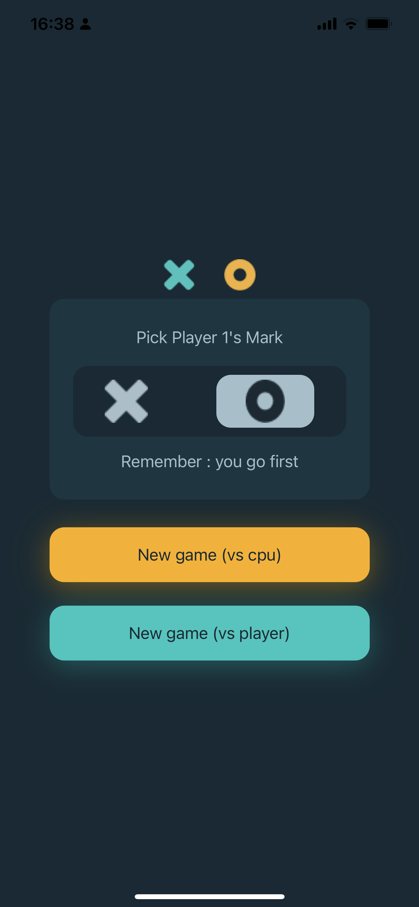

# TicTacToeApp
 

This is my first game app 

## Table of contents

- [Overview](#overview)
  - [The challenge](#the-challenge)
  - [Screenshot](#screenshot) 
- [My process](#my-process)
  - [Built with](#built-with)
  - [What I learned](#what-i-learned)
  - [Continued development](#continued-development) 
- [Author](#author) 
 

## Overview

### The challenge

Users should be able to:

- Connect to two different endpoints of the api

### Screenshot
<p align="center">
   
</p>
 
## My process

### Built with

- Swift
- SwiftUI
 
### What I learned

The most important thing in this app was working with @State and @Binding Property Wrappers
```swift
    struct ContentView: View {
    @State var player: String = ""
    ...
    
    
    NavigationLink( destination:GameView(player:$player,vs:"cpu")){
      Text("New game (vs cpu)")
       .padding()
    }
    
    struct GameView: View {
    @Binding var player: String
    
    ...
     Image("\(player)")
```
 
### Continued development

i want to refine my appdevelopment techniques, in this project i continued to work with the functionality, also i want to add more responsiveness to the app 

## Author

- Website - [karen cofre](https://karencofre.tech)   
